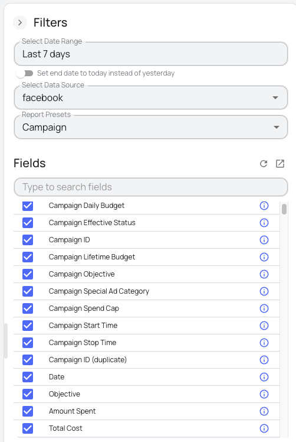

# dbt-BigQuery Package for Facebook Ads Data

A production-ready dbt package that transforms raw Facebook Ads data integrated with [Windsor.ai](http://Windsor.ai) into clean, analytics-ready tables in BigQuery following standardized architecture patterns. 

You can find a complete list of [available Facebook Ads fields here](https://windsor.ai/data-field/facebook/).

## 🚀 Features of this dbt package:

* **Multi-level data modeling**: Structured models for campaigns, ads, insights, and audience data.  
* **Audience analytics:** Demographic and location-based performance metrics.  
* **Business KPIs out of the box:** Pre-calculated metrics like CTR, CPC, ROAS, and conversion rates.  
* **Reusable macros:** 5 modular macros for consistent metric calculation and data transformation.  
* **Custom tests:** 4 built-in tests to ensure data quality and prevent duplicates.  
* **Type safety:** Safe and consistent casting of strings to numeric types using `safe_cast`.  
* **Performance optimized:** Designed for BigQuery efficiency with native data types and filter logic.  
* **Built for Windsor.ai:** Tailored to Windsor.ai's Facebook Ads schema and sync behavior.  
* **Currency normalization**: Built-in exchange rate support for multi-currency reporting.

## ⚙️ Prerequisites:

Before using this package, you have to integrate Facebook Ads data into BigQuery using the [Windsor.ai connector](https://windsor.ai/connect/facebook-ads-google-bigquery-integration/) to ensure the schema matches the expected format:

1. [Sign up](https://onboard.windsor.ai/) for Windsor.ai's free trial.  
2. Connect your Facebook Ads account(s).  
3. Choose BigQuery as a data destination.  
4. Create and run a destination task for every required table by selecting specific fields. You can use the Report Presets dropdown to automatically select the necessary fields for each model (ad, campaign, location or user).



### ✅ Required BigQuery tables

These tables must be created with the field structure defined in the `sources.yml` file:

1. **`facebook_ads_windsor_campaigns`**  

   *Use **Campaign** preset from the Report Presets dropdown*

   *Campaign-level info such as objectives, budgets, and status* 

   **Key fields**: `account_id`, `campaign_id`, `campaign_name`, `campaign_objective`, `campaign_status`, `campaign_budget_*`

2. **`facebook_ads_windsor_ads`**  

   *Use **Ad** preset from the Report Presets dropdown*

   *Ad creative metadata and configuration*

   **Key fields**: `actor_id`, `ad_id`, `ad_name`, `adset_id`, `title`, `body`, `link_url`, `thumbnail_url`

3. **`facebook_ads_windsor_insights`**  

   **Required Fields:** *Account currency, Account ID, Account Name, Action Values Purchase, Actions Purchase, Ad ID, Ad Name, Campaign, Campaign ID, Campaign Objective, Campaign Status, Clicks, CPC, CPM, CTR, Date, Frequency, Impressions, Ad Placement, Reach, Amount Spent, Ad Status.*

   *Daily ad performance metrics*

   **Key fields**: `date`, `account_id`, `campaign_id`, `ad_id`, `impressions`, `clicks`, `spend`, `actions_purchase`

4. **`facebook_ads_windsor_audience_location`**  

   *Use **User** preset from the Report Presets dropdown*

   *Audience performance segmented by demographics (age and gender)*

   **Key fields**: `date`, `age`, `gender`, `clicks`, `frequency`, `impressions`, `reach`

5. **`facebook_ads_windsor_audience_demographics`**  

   *Use **Location** preset from the Report Presets dropdown*

   *Audience metrics segmented by location (country and region)*

   **Key fields**: `date`, `country`, `region`, `clicks`, `frequency`, `impressions`, `reach`

Windsor.ai will stream your Facebook Ads data to your BigQuery project in minutes. After verifying that the data is present, you're ready to start transforming it using this dbt package.

## 🛠 How to use this dbt package

1. Configure your dbt_project.yml:

```yaml
vars:  
  facebook_ads_source_table: 'your-project.raw_data.facebook_ads_windsor_campaigns'  
  facebook_ads_start_date: '2024-01-01'  
  exclude_test_campaigns: true  
  min_spend_threshold: 0  
  min_impressions_threshold: 1
```

2. Make sure these source tables are available in your BigQuery project:

* `facebook_ads_windsor_campaigns`  
* `facebook_ads_windsor_ads`  
* `facebook_ads_windsor_insights`  
* `facebook_ads_windsor_audience_location`  
* `facebook_ads_windsor_audience_demographics`

3. Run the models:

```bash
# Run all models  
dbt run

# Run specific layers  
dbt run --select +stg_facebook_ads    # Staging only  
dbt run --select +int_facebook_ads    # Staging + Intermediate  
dbt run --select +facebook_ads        # All models

# Run tests  
dbt test
```

## 📊 Model architecture

### Staging models

| Model | Source table | Grain | Description |
|-------|-------------|-------|-------------|
| `stg_facebook_ads__campaigns` | `facebook_ads_windsor_campaigns` | Campaign | Campaign-level metadata and hierarchy |
| `stg_facebook_ads__ads` | `facebook_ads_windsor_ads` | Ad | Ad-level creative and metadata |
| `stg_facebook_ads__insights` | `facebook_ads_windsor_insights` | Date + Account + Campaign + Ad | Daily performance metrics with deduplication |

### Intermediate models

| Model | Grain | Description |
|-------|-------|-------------|
| `int_facebook_ads__currency_normalized` | Date + Account + Campaign + Ad | Currency conversion and normalization layer |
| `int_facebook_ads__daily_metrics` | Date + Account + Campaign + Ad | Enhanced metrics with performance tiers and quality flags |

### Mart models

| Model | Grain | Description |
|-------|-------|-------------|
| `facebook_ads__base_spend` | Date + Account + Campaign + Ad | Core spend tracking with ROI-focused metrics |
| `facebook_ads__ad_performance_daily` | Date + Account + Campaign + Ad | Performance clustering and enhanced metric breakdown |
| `facebook_ads__campaign_summary` | Date + Campaign | Aggregated campaign metrics with ad-level insights |
| `facebook_ads__audience_metrics` | Date + Audience Type + Segment | Audience-level insights by demographic and location |

### 🏗️ Project structure

```
models/  
├── staging/  
│   └── facebook_ads/  
│       ├── stg_facebook_ads__campaigns.sql  # Campaign entities  
│       ├── stg_facebook_ads__ads.sql        # Ad creative entities    
│       ├── stg_facebook_ads__insights.sql   # Performance insights  
│       ├── sources.yml                      # Source table definitions  
│       └── schema.yml                       # Model documentation & tests  
├── intermediate/  
│   └── facebook_ads/  
│       ├── int_facebook_ads__currency_normalized.sql  # Currency conversion  
│       ├── int_facebook_ads__daily_metrics.sql       # Enhanced metrics  
│       └── schema.yml                                 # Model documentation & tests  
├── marts/  
│   └── facebook_ads/  
│       ├── facebook_ads__base_spend.sql               # Core spend tracking  
│       ├── facebook_ads__ad_performance_daily.sql     # Full performance suite  
│       ├── facebook_ads__campaign_summary.sql         # Campaign aggregated metrics  
│       ├── facebook_ads__audience_metrics.sql         # Audience analytics  
│       └── schema.yml                                 # Model documentation & tests  
analysis/  
├── docs/  
│   ├── package_capabilities.md             # Package capabilities and features documentation  
│   ├── field_mapping.md                    # Field mapping reference  
│   └── macros_documentation.md             # Macros and custom tests documentation  
├── validation_row_count_consistency.sql    # Row count validation  
├── validation_spend_totals.sql             # Spend totals validation  
├── validation_key_field_consistency.sql    # Key field validation  
├── validation_metric_consistency.sql       # Metric consistency validation  
├── validation_data_quality.sql             # Data quality validation  
├── validation_business_logic.sql           # Business logic validation  
└── windsor_data_profiling.sql              # Data profiling queries  
data/  
└── exchange_rates.csv                      # Sample exchange rate data  
tests/  
├── assert_facebook_ads_data_quality.sql    # Data quality test  
└── assert_campaign_summary_aggregation.sql # Campaign aggregation validation
```

## ⚙️ Configuration

### Variables

| Variable | Default | Description |
|----------|---------|-------------|
| facebook_ads_start_date | 2024-01-01 | Start date for data processing |
| exclude_test_campaigns | true | Filter out test campaigns/ads |
| min_spend_threshold | 0 | Minimum spend to include records |
| min_impressions_threshold | 1 | Minimum impressions to include records |

### Data quality features

* **Deduplication:** Removal of duplicate records by grain.  
* **Type conversion:** Safe string to numeric casting for purchase fields.  
* **Null handling:** Coalesce logic for missing data.  
* **Test coverage:** dbt tests for data validation.

## 🧪 Testing & Validation

Located in `analysis/`, these tests help monitor data consistency.

### Built-in dbt tests:

* **Uniqueness:** Ensures grain uniqueness across models.  
* **Not null:** Validates required fields.  
* **Referential integrity:** Checks hierarchical relationships.  
* **Business logic:** Validates calculated metrics (ROAS, CPC, etc.).  
* **Data quality:** Flags invalid or suspicious data.

### Validation queries

Located in `analysis/` for ongoing data consistency monitoring:

* **Row count consistency:** Validates identical record counts between mart models.  
* **Spend totals validation:** Ensures spend amounts match when aggregated.  
* **Key field consistency:** Checks for missing records between models.  
* **Metric consistency:** Validates that calculated metrics are identical.  
* **Data quality validation:** Checks for duplicates and invalid values.  
* **Business logic validation:** Validates business rules and metric calculations.

Run tests and validations:

```bash
# Run all tests  
dbt test

# Run validation queries  
dbt compile --select analysis/validation_*  
# Then execute the compiled SQL in your BigQuery console
```

## 📈 Calculated metrics

### Performance metrics

* Click-Through Rate: `clicks / impressions * 100`  
* Cost Per Click: `spend / clicks`  
* Cost Per Mille: `spend / impressions * 1000`

### Conversion metrics

* Cost Per Conversion: `spend / conversions`  
* Return on Ad Spend: `conversion_value / spend`  
* Conversion Rate: `conversions / clicks * 100`

## 🔧 Troubleshooting

### Common issues:

* **String conversion errors:** The package uses `safe_cast()` to handle string-to-numeric conversions for fields like `actions_purchase`, `action_values_purchase`, and `ctr`.  
* **Duplicate records:** The insights model includes deduplication logic that retains the record with the highest `spend` or `impressions` per grain.  
* **Test failures:** Check the `return_on_ad_spend_consistency` test, which handles cases where conversion data may not be available.

## 🔧 Macros & Custom tests

This package includes 5 utility macros and 4 custom tests designed specifically for Facebook Ads data:

### Utility macros

* `calculate_performance_metrics`: Calculate CTR, CPC, CPM, conversion rate, ROAS, and cost per conversion.  
* `classify_performance_tier`: Classify performance into tiers (High/Good/Average/Poor/No Spend).  
* `standardize_campaign_objective`: Standardize Facebook campaign objectives to consistent names.  
* `validate_facebook_ads_data`: Generate data quality validation flags.  
* `generate_facebook_ads_surrogate_key`: Generate consistent surrogate keys for different grains.

### Custom tests

* `facebook_ads_ctr_range`: Test CTR values are within the 0-100% range.  
* `facebook_ads_metric_consistency`: Test clicks never exceed impressions.  
* `facebook_ads_spend_consistency`: Test spend consistency with activity.  
* `facebook_ads_performance_tier_valid`: Test performance tier values are valid.

Usage example:

```sql
select   
    date_day,  
    campaign_id,  
    impressions,  
    clicks,  
    spend,  
    {{ calculate_performance_metrics('impressions', 'clicks', 'spend') }},  
    {{ classify_performance_tier('click_through_rate') }} as performance_tier  
from my_facebook_ads_data
```

## 📚 Additional resources

* **Package capabilities:** Review `analysis/docs/package_capabilities.md` for feature documentation.  
* **Field mapping:** Review `analysis/docs/field_mapping.md` for field documentation.  
* **Macros documentation:** Review `analysis/docs/macros_documentation.md` for detailed macro usage and examples.  
* **Data profiling:** Use `analysis/windsor_data_profiling.sql` to understand your data.  
* **Source documentation:** Review `models/staging/facebook_ads/sources.yml` for field definitions.  
* **Model documentation:** Check schema.yml files in each layer for model and column documentation.  
* **Facebook Ads to BigQuery integration documentation:** Read this guide [https://windsor.ai/how-to-integrate-facebook-ads-into-bigquery/](https://windsor.ai/how-to-integrate-facebook-ads-into-bigquery/) for available integration methods.  
* **Validation queries:** Use `analysis/validation_*.sql` files for ongoing data consistency monitoring.

## 🤝 Contributing

1. Fork the repository  
2. Create a feature branch  
3. Make your changes  
4. Add tests for new functionality  
5. Submit a pull request

## 📊 Exchange rate data

The `data/exchange_rates.csv` file contains sample exchange rate data that has been generated for demonstration and testing purposes. This data should not be used for production financial calculations or real-world currency conversions.

For production use, please replace with actual exchange rate data from authoritative financial sources.